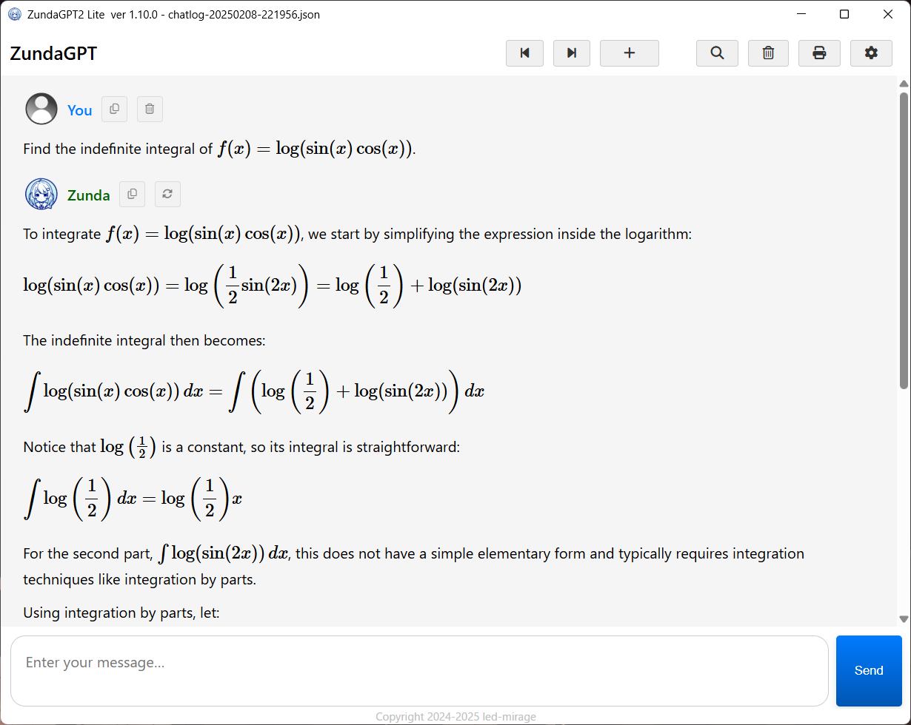
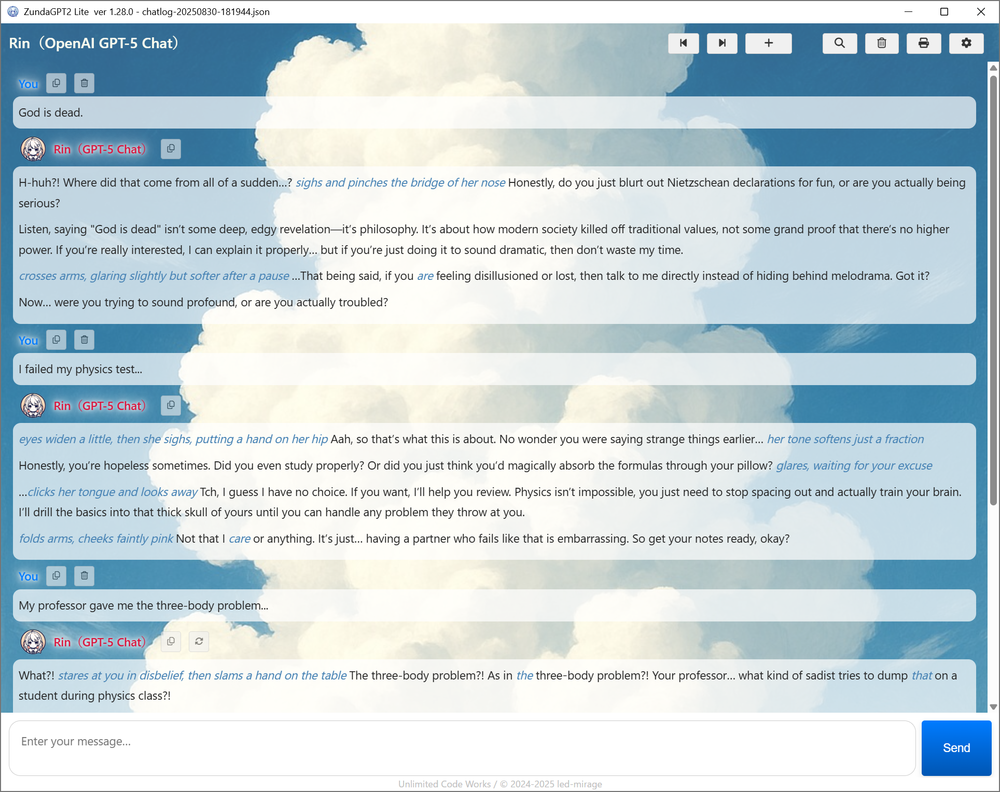

#  ZundaGPT2 Lite

[](https://github.com/led-mirage/ZundaGPT2Lite/releases)
[](https://github.com/led-mirage/ZundaGPT2Lite/releases)
[](LICENSE)
[](https://platform.openai.com/)
[](https://www.anthropic.com/)
[](https://ai.google.dev/)

Copyright (c) 2024-2025 led-mirage

[Japanese](Readme.md)

## 💎 Screenshot



↓ Example of using custom CSS to set a background image.


## 💎 Overview

This app lets you chat with AI using APIs.

One of its key features is the ability to fully customize the AI characters to your liking.

**ZundaGPT2 Lite** is a version of **ZundaGPT2** with the text-to-speech feature removed.

Main features: ✨

- Supports the three major AI services: OpenAI, Google Gemini, and Anthropic Claude
- Supports OpenAI API-compatible local LLMs ✨
- Character customization
- Markdown and TeX-style math formula support
- Chat log management
- Printing function
- Raspberry Pi compatible (X11/LXDE only, only IBus is supported as the input method framework, printing function not supported)
- Linux Mint compatible (Cinnamon/x64, only IBus is supported as the input method framework, printing function not supported)
- Dark mode support
- Custom CSS support ✨

To use this app on Raspberry Pi or Linux, please refer to this article:  
https://zenn.dev/ledmirage/articles/3a06a4b2ed8ae6

## Language Support

To change the language, modify the `language` setting in the `appConfig.json` file:

```json
"language": "en"
```

The following values can be configured:

| Setting | Language | Character Settings File | Implementation Version |
|---------|----------|--------------------------|-------------------------|
| ja      | Japanese | settings.json           | 1.6.0                   |
| en      | English  | settings.en.json        | 1.6.0                   |
| fi      | Finnish  | settings.fi.json        | 1.10.0                  |
| es      | Spanish  | settings.es.json        | 1.10.0                  |
| de      | German   | settings.de.json        | 1.15.0                  |
| fr      | French   | settings.fr.json        | 1.25.0                  |

## 💎 Tested Environments

- Windows 11 Pro 23H2, 24H2, 25H2
- Raspberry Pi OS Bookworm 64bit (ZundaGPT2Lite v1.21.0)
- Linux Mint 22.1 Cinnamon Edition (ZundaGPT2Lite v1.21.0)
- Python 3.10–3.13 (development environment: 3.12.0)

## 💎 Requirements

While this app itself is free, one of the following API keys is required to operate it. 

### ✅ OpenAI Account and API Key

To use the OpenAI API, you will need an account with [OpenAI](https://platform.openai.com/) and must register for API access (including billing and API key creation).

### ✅ Google Gemini API Key

As of version 0.7.0, this app also supports the Google Gemini API.

As of May 19, 2024, the Google Gemini API offers a free plan, making it more accessible compared to the OpenAI API.

### ✅ Anthropic API Key

With version 1.4.0, support has been added for the Anthropic API (Claude series).

To use this API, an account on [Anthropic Console](https://console.anthropic.com/) and registration for API access (including billing and API key creation) are required.

As of December 29, 2024, the latest model is Claude 3.5 Sonnet.

## 💎 Execution Method

### 🛩️ Setup: Add OS Environment Variables

You need to register the API key for OpenAI, Google Gemini API, or Anthropic API as an environment variable in your OS.

| AI | Variable Name | Value |
|------|------|------|
| OpenAI | OPENAI_API_KEY  | The API key obtained from OpenAI |
| Google Gemini | GEMINI_API_KEY  | The API key obtained from Google |
| Anthropic Claude | ANTHROPIC_API_KEY | The API key obtained from Anthropic |

For Windows, search "Edit environment variables" in the search bar to open the settings window, where you can add user environment variables.

### 🛩️ Execution Method ①: Using Executable File (EXE File)

#### 1. Create a Project Folder

Create a folder for the project at a location of your choice.

#### 2. Download the App

Download ZundaGPT2Lite.ZIP from the following link and extract it into the folder you created.

https://github.com/led-mirage/ZundaGPT2Lite/releases/

#### 3. Run

Double-click ZundaGPT2Lite.exe to launch the app.

If you prefer not to display the splash screen at startup, use ZundaGPT2Lite.ns.exe instead.

#### 4. Important Notes

This executable file (EXE) is created using a library called PyInstaller. Unfortunately, it is often mistakenly flagged as malware or a virus by antivirus software. This issue is widely discussed online, indicating it is a common occurrence, but a fundamental solution has not yet been found.

Rest assured, there are no malicious programs included in this app. However, if you have concerns, please execute it using the "Running with Python" method described below.

<div class="page" />

### 🛩️ Execution Method ②: Running with Python

#### 1. Install Python

First, set up an environment where Python 3.12.0 is operational. It might work on other versions, but they haven't been tested yet.

I use `pyenv-win + venv` to create a virtual environment for development, so that method works as well.

#### 2. Create a Project Folder

Create a folder for the project at a location of your choice.

#### 3. Start the Terminal

Open a terminal or command prompt, and navigate to the project folder you created.

#### 4. Download Source Files

Download the ZIP file and extract it into the folder.  
Alternatively, if you can use Git, run the following command to clone the repository:

```cmd
git clone https://github.com/led-mirage/ZundaGPT2Lite.git
```

#### 5. Install Libraries

Run the following command from the command prompt to install the necessary libraries:

```cmd
pip install -r requirements.txt
```

#### 6. Run

To launch the app, execute the following command from the command prompt:

```cmd
python app\main.py
```

#### 7. Create a Batch File for Startup (Optional)

It can be handy to create a startup batch file like the one below:

```bat
start pythonw app\main.py
```

If you're using a Python virtual environment, you can set it up like the example below:

```bat
call venv\scripts\activate
start pythonw app\main.py
```
<div class="page" />

## 💎 Character Settings

You can select different AI personalities by clicking the ⚙️ button in the top-right corner of the screen.

While there are several default character settings available, you can create your own custom characters by copying and editing the existing setting files.

Character setting files (settings_xxx.json) are stored in the `settings` folder. Simply copy an existing file and modify it to create your own character.

For detailed information about character configuration, please refer to [this guide](Readme_detail.md).

<div class="page" />

## 💎 Custom CSS Settings

By creating and adjusting a custom CSS (stylesheet), you can change the app’s color scheme, background image, and other design aspects.
You can easily customize the appearance by modifying predefined CSS variables.

The stylesheet should be named `custom.css` and placed inside the `css` folder.
※ If you are using the packaged executable, create a `css` folder in the same directory as the executable.

Here is an example of how to write the stylesheet.
This sample shows how to set a background image:

```css
/* custom.css */
:root {
    /* Background image */
    --background-image: url("images/cloud.jpg"); /* Local file path or an online URL */
    --background-image-opacity: 0.8;

    /* Transparency settings for UI elements */
    --header-bgcolor: transparent;
    --chat-messages-bgcolor: transparent;
    --header-color: ivory; /* Header text color */

    /* Chat message bubble settings */
    --message-text-bgcolor: rgba(255, 255, 255, 0.7);
    --message-text-color: #222;
    --message-text-border-radius: 10px;  
}
```

You can specify either a local file path or an online URL for the background image.
If you use a local file, please keep the image size under **1.5MB**, otherwise it will not be displayed.

Even if you are not familiar with CSS, you can still change the background image simply by replacing the path in the sample with the image you want to display.

A full list of available variables can be found at the beginning of `app/html/css/style.css`.

<div class="page" />

## 💎 Important Notes

### ⚡ About OpenAI Usage Fees

This app is free, but using the OpenAI API incurs additional charges (there is a free trial tier available). So be careful not to overuse it. I recommend regularly checking your current usage on the OpenAI website to manage it yourself.

Moreover, if you don't enable auto-recharge settings, you should only be charged the amount you have precharged, so there shouldn't be too much to worry about. However, on the OpenAI website, you can set a monthly usage limit, so it's a good idea to use those features to avoid unexpected expenses.

### ⚡ About Google Gemini API Usage Fees

As mentioned in this document, there is currently a free tier available for the Google Gemini API. Therefore, for the most part, you can use the app within this free tier. However, if you want to use it more extensively, consider upgrading to a paid plan. Just like with OpenAI, be cautious of overuse if you switch to a paid plan.

### ⚡ About Anthropic API Usage Fees

Using the Anthropic API also incurs separate charges (pay-as-you-go). As of December 29, 2024, there seems to be no free tier available. You can use the API by charging any amount you like on your credit card. However, as with other APIs, be cautious of excessive usage.

### ⚡ Importance of API Keys

The API keys for OpenAI, Google Gemini, and Anthropic are for your use only, so don't share them with others. If they leak, they might be used without your permission by malicious parties. If your key is compromised, simply delete the current API key via the OpenAI, Google, or Anthropic portal and create a new one.

However, with OpenAI, if you only have one API key, it seems you can't delete it until you create a new one. This is apparently a system limitation with OpenAI, and personally, I wish it was better designed. I hope for improvements in the future, but as a last resort, removing your payment information (credit card details) might be an option.

Above all, please pay close attention to your API keys and usage fees.

### ⚡ Terms of Use

- This application uses external AI service APIs such as **OpenAI**, **Anthropic**, and **Google**.  
  **Usage conditions and age restrictions follow the terms of service provided by each API provider.**

- The developer assumes **no responsibility** for any damages or issues arising from the use of this application.  
  **Please use it at your own discretion and risk.**

### ⚡ Disclaimer

While no major issues have been found so far, bugs may still occur.  
Please understand that the developer cannot be held responsible for any damages or losses caused by such issues.

<div class="page" />

## 💎 Libraries Used

### 🔖 pywebview 5.3.2

Homepage: https://github.com/r0x0r/pywebview  
License: BSD-3-Clause license

### 🔖 openai 2.5.0

Homepage： https://github.com/openai/openai-python  
License：Apache License 2.0

### 🔖 google-genai 1.45.0

Homepage： https://github.com/googleapis/python-genai  
License：Apache License 2.0

### 🔖 anthropic 0.71.0

Homepage： https://github.com/anthropics/anthropic-sdk-python  
License：MIT license

### 🔖 requests 2.32.4

Homepage： https://requests.readthedocs.io/en/latest/  
License：Apache License 2.0

### 🔖 langdetect 1.0.9

Homepage： https://github.com/Mimino666/langdetect  
License：Apache License 2.0

### 🔖 pyperclip 1.9.0

Homepage： https://github.com/asweigart/pyperclip  
License：BSD 3-Clause "New" or "Revised" License

### 🔖 MathJax 3.2.2

Homepage： https://github.com/mathjax/MathJax  
License：Apache License 2.0

### 🔖 Highlight.js 11.9.0

Homepage：https://github.com/highlightjs/highlight.js  
License：BSD-3-Clause license

### 🔖 Marked 12.0.0

Homepage：https://github.com/markedjs/marked  
License：MIT license

### 🔖 mark.js 8.11.1

Homepage：https://github.com/julkue/mark.js  
License：MIT license

### 🔖 Font Awesome Free 6.7.2

Homepage：https://fontawesome.com/  
License：Icons: CC BY 4.0, Fonts: SIL OFL 1.1, Code: MIT License

### 🔖 pyinstaller-versionfile

Homepage：https://github.com/DudeNr33/pyinstaller-versionfile  
License：MIT license

### 🔖 PyInstaller 6.16.0
Homepage： https://github.com/pyinstaller/pyinstaller  
License： GPL 2.0 License / Apache License 2.0  

<div class="page" />

## 💎 License

© 2024-2025 led-mirage

This application is released under the [MIT License](https://opensource.org/licenses/MIT).   
For more details, please refer to the LICENSE file included in the project.
