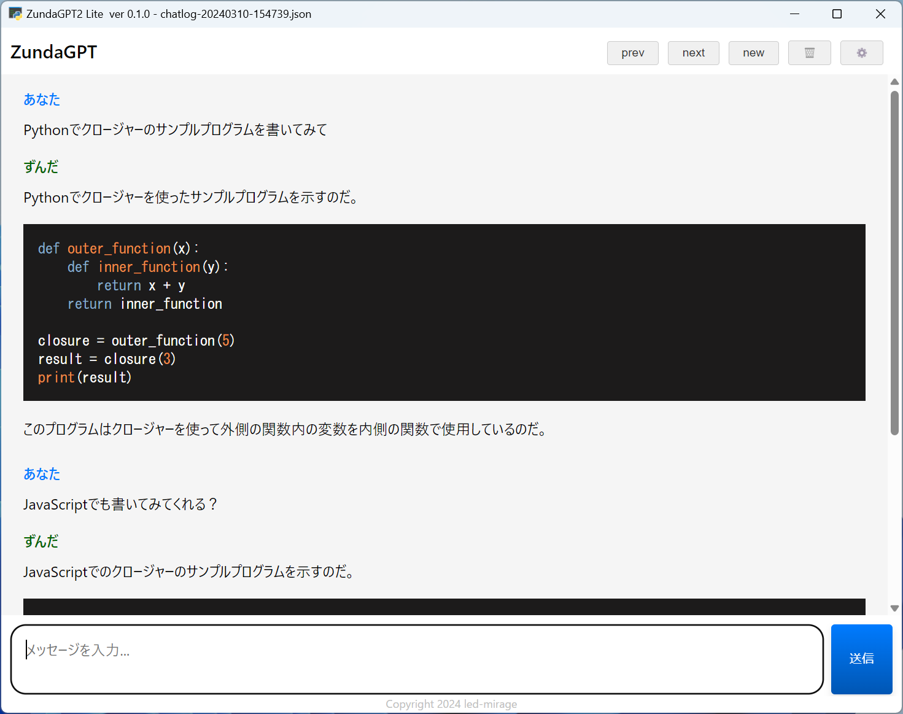
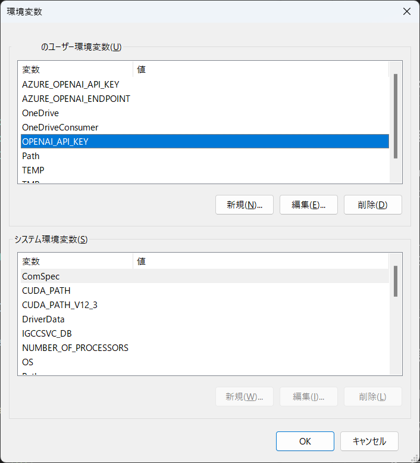
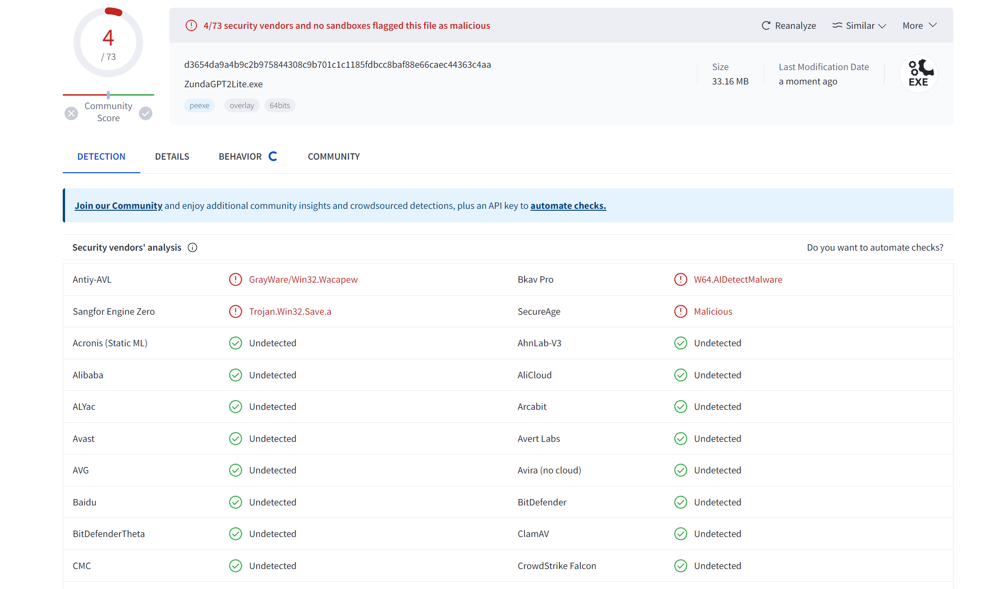

#  ZundaGPT2 Lite

Copyright (c) 2024 led-mirage

## 概要

ZundaGPT2(https://github.com/led-mirage/ZundaGPT2) のライト版なのだ。ZundaGPT2から音声読み上げ機能を省いたバージョンなのだよ。

OpenAI、AzureOpenAI Service、Google Geminiを使って、AIとチャットできるチャットクライアントソフトウェアなのだ。

## 最新情報 バージョン 1.2.0

アプリのアイコンを追加したのだ！

## スクリーンショット



## 動作確認環境

- Windows 11 Pro 23H2
- Python 3.12.0

## 必要なもの

このアプリを動作させるには以下のものが必要になるのだ。ここでは軽く触れておくだけにするけど、詳しいことは[こっち](Readme_detail.md)を見てほしいのだ。

### ✅ OpenAIアカウントとAPIキー

このアプリ自体は無料だけど、[OpenAI](https://platform.openai.com/)のアカウントとAPIの利用登録（課金およびAPIキーの作成）が必要なのだ。

### ✅ Google Gemini APIのAPIキー

バージョン0.7.0からGoogle Gemini APIにも対応したので、OpenAIの代わりにGoogle Gemini APIを使用することもできるのだ。

現時点でGoogle Gemini APIには無料プランが設定されているので、OpenAIのAPIよりも気軽に利用することができるのだ。Google Gemini APIを使用したい場合は、[専用の資料](Readme_gemini.md)を用意したので、それを参照して欲しいのだ。

## 実行方法

### 🛩️ 準備：OSの環境変数を追加

OpenAIのAPIキー、もしくはGoogle Gemini APIのAPIキーをOSの環境変数に登録しておく必要があるのだ。

| AI | 変数名 | 値 |
|------|------|------|
| OpenAI | OPENAI_API_KEY  | OpenAIで取得したAPIキー |
| Google Gemini | GEMINI_API_KEY  | Googleで取得したAPIキー |

Windowsの場合は、Windowsの検索窓で「環境変数を編集」で検索すると設定画面が立ち上がるので、そこでユーザー環境変数を追加すればいいのだ。



### 🛩️ 実行方法①：実行ファイル（EXEファイル）を使う方法

#### 1. プロジェクト用のフォルダの作成

任意の場所にプロジェクト用のフォルダを作成するのだ。

#### 2. アプリのダウンロード

以下のリンクから ZundaGPT2Lite.ZIP をダウンロードして、作成したフォルダに展開するのだ。

https://github.com/led-mirage/ZundaGPT2Lite/releases/tag/v1.2.0

#### 3. 実行

ZundaGPT2Lite.exeをダブルクリックすればアプリが起動するのだ。

#### 4. 注意事項

この実行ファイル（EXEファイル）は PyInstaller というライブラリを使って作成しているんだけど、割と頻繁にウィルス対策ソフトにマルウェアとかウィルスとかに誤認されるのだ。ネットとかを見るとこの問題が結構書かれているので、よくある事象のようだけど、残念なことに根本的な解決策は見つかっていないのだ。

もちろん、このアプリに悪意のあるプログラムは入っていないのだけど、気になる人は下の「Pythonで実行する方法」で実行してほしいのだ。

### 🛩️ 実行方法②：Pythonで実行する方法

#### 1. Pythonのインストール

あらかじめ Python 3.12.0 が動く環境を作っておくのだ。他のバージョンでも動くかもしれないけど、確認はしていないのだよ。

ボクは pyenv-win + venv で仮想環境を作ってそこで開発しているから、そういった方法でも問題ないのだ。

#### 2. プロジェクト用のフォルダの作成

任意の場所にプロジェクト用のフォルダを作成するのだ。

#### 3. ターミナルの起動

ターミナルかコマンドプロンプトを起動して、作成したプロジェクトフォルダに移動するのだ。

#### 4. ソースファイルのダウンロード

ZIPファイルをダウンロードして作成したフォルダに展開するのだ。  
または、Gitが使える方は以下のコマンドを実行してクローンしてもOKなのだ。

```bash
git clone https://github.com/led-mirage/ZundaGPT2Lite.git
```

#### 5. ライブラリのインストール

コマンドプロンプトから以下のコマンドを実行して、必要なライブラリをインストールするのだ。

```bash
pip install -r requirements.txt
```

#### 6. 実行

コマンドプロンプトから以下のコマンドを実行するとアプリが起動するのだ。

```bash
python app\main.py
```

#### 7. 起動用のバッチファイル（オプション）

以下のような起動用のバッチファイルを用意しておくと便利なのだ。

```bash
start pythonw app\main.py
```

Pythonの仮想環境を使用している場合は、以下の例のようにすればOKなのだ。

```bash
call venv\scripts\activate
start pythonw app\main.py
```

## 注意事項

### ⚡ OpenAIの利用料金について

このアプリは無料だけど、OpenAI APIを使うには別途料金が発生するのだ（お試し用の無料枠もあるけど）。なので、使い過ぎには注意するのだ。定期的にOpenAIのサイトで現在の利用状況を確認するなどして自己管理して欲しいのだ。

そもそも自動チャージ設定を有効にしなければチャージされた分しか課金されないはずなので、そこまで心配する必要はないけれど、OpenAIのサイトでは月毎の利用上限なども設定できるのでそれらを活用して思わぬ出費を防ぐといいのだ。

### ⚡ Google Gemini APIの利用料金について

[この資料](Readme_gemini.md)にも書いたけど、現時点でGoogle Gemini APIには無料枠があるのだ。だから、基本的には無料枠を使ってアプリを利用すればいいと思うけど、もっとハードに使いたい場合は有料プランを考えてみるのもいいのだ。ただ、有料プランにした場合は、先に書いたOpenAIと同じように使い過ぎには注意して欲しいのだ。

### ⚡ APIキーの重要性について

OpenAIやGoogle GeminiのAPIキーはあなただけのものなので、人に教えたらダメなのだ。流出すると悪い人に勝手に使われてしまう可能性があるのだ。もし流出してしまったら、OpenAIやGoogleのサイトで現在使っているAPIキーを削除して、別のAPIキーを作ればいいのだ。

ただOpenAIでは、APIキーをひとつしか持っていない場合、新しいAPIキーを作ってからじゃないと古いAPIキーを削除できないようなのだ。これはOpenAIの仕様のようなんだけど、ボク的にはちょっといただけない仕様だと思っているのだ。将来的に改善することを願っているけれど、最悪支払い情報（クレジットカード情報）を削除してしまえばいいような気もするのだ。

なにはともあれ、APIキーと利用料金には注意を払って欲しいのだ。

### ⚡ ウィルス対策ソフトの誤認問題

上でも書いているけれど、配布している実行ファイル（EXEファイル）が、マルウェアやウィルスに誤認されてしまうことがあるのだ。問題はPythonのプログラムを一つの実行ファイル（EXEファイル）にまとめることにあるようなのだが、回避方法がないためどうしようもないのだ。

これが嫌な人は（ボクも嫌だけど）、Python本体をインストールしてPythonから普通に実行して欲しいのだ。実行ファイルのほうが手軽だし、そのほうがPythonに詳しくない人にとっては簡単なんだけど、誤認問題がついて回ることは覚えておいて欲しいのだ。

VirusTotalでのチェック結果は以下の通りなのだ。  
（73個中4個のアンチウィルスエンジンで検出 :2024/06/23 v1.2.0）。



### ⚡ 免責事項

いまのところ特に問題点は見つかっていないけど、バグなんてものは潜在的に必ずあるし、０になるなんてことはあり得ないのだ。また、もしバグがあってそのせいで貴方に損害を与えたとしても、著作権者はいかなる責任も負いかねるのでその点を理解して使って欲しいのだ。

## 使用しているライブラリ

### 🔖 pywebview 4.4.1

ホームページ： https://github.com/r0x0r/pywebview  
ライセンス：BSD-3-Clause license

### 🔖 openai 1.33.0

ホームページ： https://github.com/openai/openai-python  
ライセンス：Apache License 2.0

### 🔖 google-generativeai 0.6.0

ホームページ： https://github.com/google-gemini/generative-ai-python  
ライセンス：Apache License 2.0

### 🔖 requests 2.32.3

ホームページ： https://requests.readthedocs.io/en/latest/  
ライセンス：Apache License 2.0

### 🔖 MathJax 3.2.2

ホームページ： https://github.com/mathjax/MathJax  
ライセンス：Apache License 2.0

### 🔖 Highlight.js 11.9.0

ホームページ：https://github.com/highlightjs/highlight.js  
ライセンス：BSD-3-Clause license

### 🔖 Marked 12.0.0

ホームページ：https://github.com/markedjs/marked  
ライセンス：MIT license

### 🔖 mark.js 8.11.1

ホームページ：https://github.com/julkue/mark.js  
ライセンス：MIT license

## ライセンス

© 2024 led-mirage

本アプリケーションは [MITライセンス](https://opensource.org/licenses/MIT) の下で公開されているのだ。詳細については、プロジェクトに含まれる LICENSE ファイルを参照して欲しいのだ。

## バージョン履歴

### 0.1.0 (2024/3/10)
 
- ファーストリリース
- ZundaGTP2 v0.5.0から分岐

### 0.1.1 (2024/3/16)

- 数式が正常にレンダリングされないバグを修正

### 0.2.0 (2024/3/24)

- メッセージの削除ボタンを追加

### 0.3.0 (2024/3/30)

- 再回答ボタンを追加
- チャットログが１つしかない場合に、そのログを削除できないバグを修正

### 0.4.0 (2024/4/7)

- メッセージ送信中止機能を追加
- Ctrl + F でテキストを検索する機能を追加（F3 or Shift + F3で候補移動）
- Welcomeメッセージの追加
- 設定ファイルのフォーマット変更（Welcome関連項目追加）
- Copyrightを動的に設定するように修正
- 英文が右端で折り返さない問題を修正

### 0.5.0 (2024/4/21)

- Readmeの使用しているライブラリ欄に、pywebviewの記載が洩れていたため追記
- openaiのバージョンを1.12.0から1.23.2に更新
- ChatAPIのタイムアウト値を設定ファイル（app_config.json）に持つように変更
- AIの回答中にあるURLが正しくリンク表示にならない問題に対処

### 0.6.0 (2024/4/29)

- Tex形式の行列式が正しく表示されない問題を解消

### 0.7.0 (2024/5/19)

- Google Gemini APIに対応

### 1.0.0 (2024/6/08)

- バージョン番号をZundaGTP2に合わせて1.x.xに改定
- requestsのバージョンを2.32.3に更新

### 1.0.1 (2024/06/08)

- openaiのバージョンを1.33.0に更新
- google-generativeaiのバージョンを0.6.0に更新
- appConfig.jsonの初期値を訂正

### 1.1.0 (2024/06/22)

- 印刷機能の追加
- 画面上部のボタンにツールチップを追加
- PyInstallerのバージョンを6.8.0に更新

### 1.1.1 (2024/06/22)

- 印刷機能の不備を修正するHotfix

### 1.2.0 (2024/06/23)

- アプリケーションアイコンの追加
- 印刷する場合、codeブロックの中のテキストを右端で折り返すように修正
