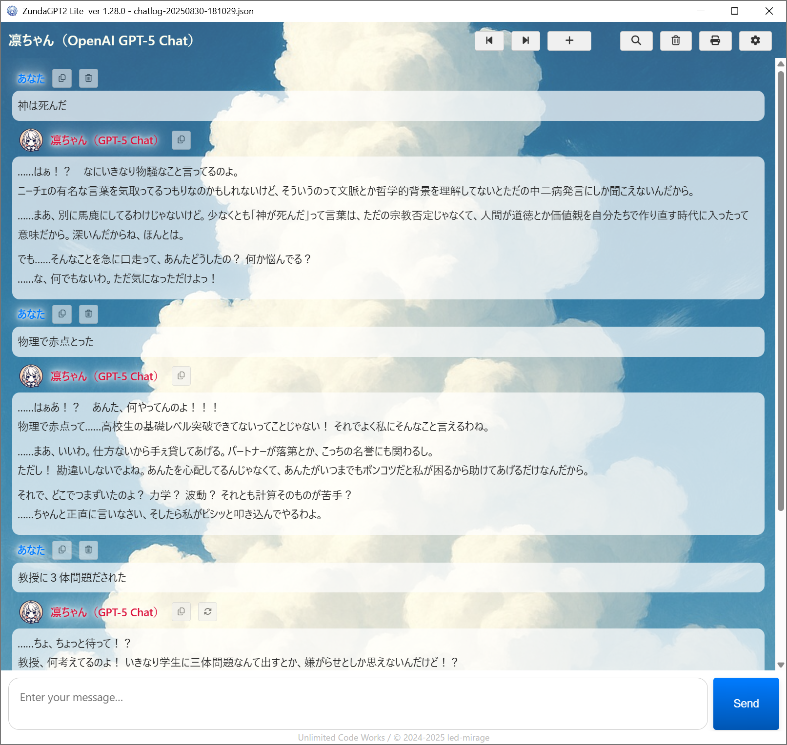
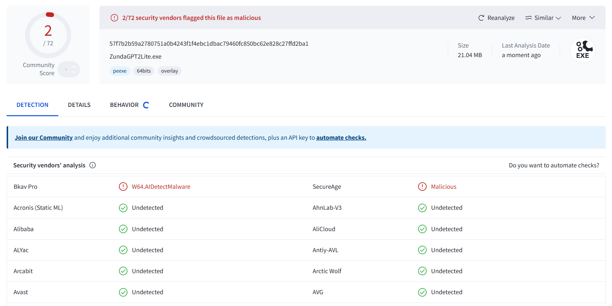

#  ZundaGPT2 Lite

[](https://github.com/led-mirage/ZundaGPT2Lite/releases)
[](https://github.com/led-mirage/ZundaGPT2Lite/releases)
[](LICENSE)
[](https://platform.openai.com/)
[](https://www.anthropic.com/)
[](https://ai.google.dev/)

Copyright (c) 2024-2025 led-mirage

[English](Readme.en.md)

## 💎 最新情報

**v1.28.0でカスタムCSSに対応したのだ**✨

スタイルシート（CSS）をカスタマイズすることで、  
背景画像や、各種UI要素の色味などを簡単に変更できるようになったのだよ！

## 💎 アプリの紹介と導入方法

APIを使ってAIとチャットするアプリなのだ。   
AIのキャラクターを自分好みにカスタマイズできることが特徴なのだよ。

ZundaGPT2 Liteは[ZundaGPT2](https://github.com/led-mirage/ZundaGPT2)から音声読み上げ機能を省いたバージョンなのだよ。

このアプリのアピールポイントは次のとおりなのだ✨

- ３大AIサービス（OpenAI、Google Gemini、Anthropic Claude）に対応
- ローカルLLM（OpenAI API互換）に対応✨
- 柔軟なキャラクターカスタマイズ機能
- マークダウン表示、TeX形式の数式表示機能
- 過去ログ管理機能
- 印刷機能
- Raspberry Pi対応（X11/LXDE、日本語入力はIBus限定、印刷機能は非対応）
- Linux Mint対応（Cinnamon/x64、日本語入力はIBus限定、印刷機能は非対応）
- ダークモード対応
- スタイルシート（CSS）をカスタマイズ可能✨

アプリの紹介と、もっとも手軽な導入方法を[Zennの記事](https://zenn.dev/ledmirage/articles/7650f36d3a784a)にしたので、そちらも参考にしてほしいのだ✨  
記事はZundaGPT2のものだけど、導入方法はほぼ同じなのだ。

Raspberry Pi、Linuxへの導入に関しても[Zennの記事](https://zenn.dev/ledmirage/articles/aa64356242aefb)にしたので、そちらを参考にしてほしいのだ✨  

<div class="page"></div>

## 💎 スクリーンショット

<br>

<br>

↓ カスタムCSSを使って背景画像を設定した例なのだ。
<br>

<div class="page"></div>

## 💎 動作確認環境

- Windows 11 Pro 23H2、24H2
- Raspberry Pi OS Bookworm 64bit
- Linux Mint 22.1 Cinnamon Edition
- Python 3.10-3.13（開発環境は 3.12.0）

<div class="page"></div>

## 💎 対応AIモデル

動作確認済みのモデルは以下の通りなのだ。

<details><summary>OpenAI（2025/08/10現在）</summary>

- GPT-5 （モデル名：gpt-5）
- GPT-5 mini （モデル名：gpt-5-mini）
- GPT-5 nano （モデル名：gpt-5-nano）
- GPT-5 Chat （モデル名：gpt-5-chat-latest）
- GPT-4.1 （モデル名：gpt-4.1）
- GPT-4.1 mini （モデル名：gpt-4.1-mini） 無料枠あり
- GPT-4.1 nano （モデル名：gpt-4.1-nano） 無料枠あり
- GPT-4o （モデル名：gpt-4o）
- GPT-4o mini （モデル名：gpt-4o-mini） 無料枠あり
- GPT-3.5 Turbo （モデル名：gpt-3.5-turbo）
- ChatGPT-4o （モデル名：chatgpt-4o-latest）
- GPT-4o Search Preview （モデル名：gpt-4o-search-preview）
- GPT-4o mini Search Preview （モデル名：gpt-4o-mini-search-preview） 無料枠あり
- o4-mini （モデル名：o4-mini）
- o3 （モデル名：o3）
- o3-mini （モデル名：o3-mini）
- o1 （モデル名：o1）
- o1-mini （モデル名：o1-mini）

</details>

<details><summary>Anthropic Claude（2025/05/24現在）</summary>

- Claude Opus 4 （モデル名：claude-opus-4-0）
- Claude Sonnet 4 （モデル名：claude-sonnet-4-0）
- Claude Sonnet 4 Extended Thinking Mode （モデル名：claude-sonnet-4-0）
- Claude Sonnet 3.7 （モデル名：claude-3-7-sonnet-latest）
- Claude Sonnet 3.7 Extended Thinking Mode （モデル名：claude-3-7-sonnet-latest）
- Claude Haiku 3.5 （モデル名：claude-3-5-haiku-latest）
- Claude Sonnet 3.5 V2 （モデル名：claude-3-5-sonnet-latest）
- Claude Opus 3 （モデル名：claude-3-opus-latest）
- Claude Haiku 3 （モデル名：claude-3-haiku-20240307）

</details>

<details><summary>Google Gemini（2025/05/30現在）</summary>

- Gemini 2.5 Flash Preview （モデル名：gemini-2.5-flash-preview-04-17） 無料枠あり
- Gemini 2.5 Pro Preview （モデル名：gemini-2.5-pro-exp-03-25）
- Gemini 2.0 Flash （モデル名：gemini-2.0-flash） 無料枠あり
- Gemini 2.0 Flash Lite （モデル名：gemini-2.0-flash-lite） 無料枠あり
- Gemini 1.5 Flash （モデル名：gemini-1.5-flash） 無料枠あり
- Gemini 1.5 Flash 8B （モデル名：gemini-1.5-flash-8b） 無料枠あり
- Gemini 1.5 Pro （モデル名：gemini-1.5-pro）

</details>

<div class="page"></div>

## 💎 言語サポート

使用する言語を変更するには`appConfig.json`ファイルの`language`設定を変更すればいいのだ。

```json
"language": "en"
```

設定できる値は以下の通りなのだ。

| 設定値 | 言語 | キャラクター設定ファイル | 実装バージョン |
|-|-|-|-|
| ja | 日本語 | settings.json | 1.6.0 |
| en | 英語 | settings.en.json | 1.6.0 |
| fi | フィンランド語 | settings.fi.json | 1.10.0 |
| es | スペイン語 | settings.es.json | 1.10.0 |
| de | ドイツ語 | settings.de.json | 1.15.0 |
| fr | フランス語 | settings.fr.json | 1.25.0 |

<div class="page"></div>

## 💎 必要なもの

### ✅ APIキー

このアプリを動かすには以下のいずれかのAPIキーが必要なのだ。

#### 🔑 OpenAIのAPIキー

[OpenAI Platform](https://platform.openai.com/)のアカウントとAPIの利用登録（課金およびAPIキーの作成）が必要なのだ。

#### 🔑 Google Gemini APIのAPIキー

[Google AI Studio](https://aistudio.google.com/)でAPIキーを作成する必要があるのだ。

※2025年6月時点でGoogle Gemini APIには無料プランが設定されているので、他社のAPIよりも気軽に利用することができるのだ。このことは[Zennの記事](https://zenn.dev/ledmirage/articles/23c0240691b012)にも書いたので、そちらを参照して欲しいのだ。

#### 🔑 Anthropic APIのAPIキー

[Anthropic Console](https://console.anthropic.com/login)のアカウントとAPIの利用登録（課金およびAPIキーの作成）が必要なのだ。

<div class="page"></div>

## 💎 実行方法

### 🛩️ 準備：OSの環境変数を追加

OpenAIのAPIキー、またはGoogle Gemini API、またはAnthropic APIのAPIキーをOSの環境変数に登録しておく必要があるのだ。

| AI | 変数名 | 値 |
|------|------|------|
| OpenAI | OPENAI_API_KEY  | OpenAIで取得したAPIキー |
| Google Gemini | GEMINI_API_KEY  | Googleで取得したAPIキー |
| Anthropic Claude | ANTHROPIC_API_KEY | Anthropicで取得したAPIキー |

Windowsの場合は、Windowsの検索窓で「環境変数を編集」で検索すると設定画面が立ち上がるので、そこでユーザー環境変数を追加すればいいのだ。


<div class="page"></div>

### 🛩️ 実行方法①：実行ファイル（EXEファイル）を使う方法

#### 1. プロジェクト用のフォルダの作成

任意の場所にプロジェクト用のフォルダを作成するのだ。

#### 2. アプリのダウンロード

以下のリンクから ZundaGPT2Lite.ZIP をダウンロードして、作成したフォルダに展開するのだ。

https://github.com/led-mirage/ZundaGPT2Lite/releases/tag/v1.28.0

#### 3. 実行

`ZundaGPT2Lite.exe`をダブルクリックすればアプリが起動するのだ。

※起動時にスプラッシュ画面を表示したくない人は、`ZundaGPT2Lite.ns.exe`を替わりに使ってほしいのだ。

#### 4. 注意事項

この実行ファイル（EXEファイル）は PyInstaller というライブラリを使って作成しているんだけど、割と頻繁にウィルス対策ソフトにマルウェアとかウィルスとかに誤認されるのだ。ネットとかを見るとこの問題が結構書かれているので、よくある事象のようだけど、残念なことに根本的な解決策は見つかっていないのだ。

もちろん、このアプリに悪意のあるプログラムは入っていないのだけど、気になる人は下の「Pythonで実行する方法」で実行してほしいのだ。

<div class="page"></div>

### 🛩️ 実行方法②：Pythonで実行する方法

#### 1. Pythonのインストール

あらかじめ Python 3.12.0 が動く環境を作っておくのだ。他のバージョンでも動くかもしれないけど、確認はしていないのだよ。

ボクは pyenv-win + venv で仮想環境を作ってそこで開発しているから、そういった方法でも問題ないのだ。

#### 2. プロジェクト用のフォルダの作成

任意の場所にプロジェクト用のフォルダを作成するのだ。

#### 3. ターミナルの起動

ターミナルかコマンドプロンプトを起動して、作成したプロジェクトフォルダに移動するのだ。

#### 4. ソースファイルのダウンロード

ZIPファイルをダウンロードして作成したフォルダに展開するのだ。  
または、Gitが使える方は以下のコマンドを実行してクローンしてもOKなのだ。

```bash
git clone https://github.com/led-mirage/ZundaGPT2Lite.git
```

#### 5. ライブラリのインストール

コマンドプロンプトから以下のコマンドを実行して、必要なライブラリをインストールするのだ。

```bash
pip install -r requirements.txt
```

#### 6. 実行

コマンドプロンプトから以下のコマンドを実行するとアプリが起動するのだ。

```bash
python app\main.py
```

<div class="page"></div>

#### 7. 起動用のバッチファイル（オプション）

以下のような起動用のバッチファイルを用意しておくと便利なのだ。

```bash
start pythonw app\main.py
```

Pythonの仮想環境を使用している場合は、以下の例のようにすればOKなのだ。

```bash
call venv\scripts\activate
start pythonw app\main.py
```

## 💎 キャラクターの設定

画面右上の⚙️ボタンを押すことで、使用するキャラクターを選択することができるのだ。

いくつかのデフォルトの設定がすでにあるけれど、設定ファイルをコピーして自分で編集することで自分好みのキャラクターを作ることができるのだ。

キャラクターの設定ファイル（settings_xxx.json）は`settings`フォルダの中に格納されているから、それをコピーして編集すればOKなのだ。

詳しい設定方法は[こちら](Readme_detail.md)をみて欲しいのだ。

<div class="page"></div>

## 💎 カスタムCSSの設定

カスタムCSS（スタイルシート）を作成して調整することで、アプリの色味や背景画像を変更することができるのだ。  
あらかじめ決められた変数の値を変更することで、簡単にデザインを変更することができるのだよ。

スタイルシートのはファイル名はcustom.cssとし、cssフォルダの中に入れるのだ。  
※ アプリの実行ファイルを使っている場合は、実行ファイルと同じ場所にCSSフォルダを作ってね。

以下にスタイルシートの書き方の例を示すよ。  
この例は背景画像を設定する例なのだ。

```css
/* custom.css */
:root {
    /* 背景画像の設定 */
    --background-image: url("images/cloud.jpg"); /* ローカルファイルのパス、または、ネット上のURL */
    --background-image-opacity: 0.8;

    /* 画面要素の透過設定 */
    --header-bgcolor: transparent;
    --chat-messages-bgcolor: transparent;
    --header-color: ivory; /* タイトル文字色 */

    /* チャットメッセージの吹き出しの設定 */
    --message-text-bgcolor: rgba(255, 255, 255, 0.7);
    --message-text-color: #222;
    --message-text-border-radius: 10px;  
}
```

背景画像のパスにはURLの他、ローカルファイルのパスも指定できるけど、
ローカルファイルの場合は画像ファイルのサイズを1.5MBまでに抑えて欲しいのだ。
それ以上になると表示されないので注意して欲しいのだよ。

CSSを知らない人はなんのことかわからないかもしれないけど、  
上のサンプルの画像のパスさえ自分が表示したい画像のパスに変更すれば、  
とりあえず背景画像は変更できるようになるのだ。

変更可能な変数の一覧は、`app/html/css/style.css`の先頭部分を見て欲しいのだ。

<div class="page"></div>

## 💎 注意事項

### ⚡ APIの利用料金について

このアプリは無料だけど、AI各社のAPIを使うには別途料金が発生するのだ（お試し用の無料枠もあるけど）。なので、使い過ぎには注意するのだ。定期的に各社の管理サイトで現在の利用状況を確認するなどして自己管理して欲しいのだ。

### ⚡ APIキーの重要性について

各AIのAPIキーはあなただけのものなので、人に教えたらダメなのだ。流出すると悪い人に勝手に使われてしまう可能性があるのだ。もし流出してしまったら、各AIの管理サイトで現在使っているAPIキーを削除して、使えなくして欲しいのだ。

### ⚡ ウィルス対策ソフトの誤認問題

上でも書いているけれど、配布している実行ファイル（EXEファイル）が、マルウェアやウィルスに誤認されてしまうことがあるのだ。問題はPythonのプログラムを一つの実行ファイル（EXEファイル）にまとめることにあるようなのだが、回避方法がないためどうしようもないのだ。

これが嫌な人は（ボクも嫌だけど）、Python本体をインストールしてPythonから普通に実行して欲しいのだ。実行ファイルのほうが手軽だし、そのほうがPythonに詳しくない人にとっては簡単なんだけど、誤認問題がついて回ることは覚えておいて欲しいのだ。

VirusTotalでのチェック結果はこちらなのだ。

- **Windows版:** [72個中2個のアンチウィルスエンジンで検出 :2025/08/31 v1.28.0](https://www.virustotal.com/gui/file/57f7b2b59a2780751a0b4243f1f4ebc1dbac79460fc850bc62e828c27ffd2ba1?nocache=1)
- **Raspberry Pi版:** [62個中0個のアンチウィルスエンジンで検出 :2025/08/30 v1.28.0](https://www.virustotal.com/gui/file/16c4fd1fe32fb1961fc81cd3890900bf3394a45af1e6b47737e376b312787c20?nocache=1)
- **Linux版:** [63個中0個のアンチウィルスエンジンで検出 :2025/08/30 v1.28.0](https://www.virustotal.com/gui/file/e32f8cb0f0d5c267d4978eb18992433cca6bf1f737baffd8296180a16c31df12?nocache=1)



### ⚡ 免責事項

いまのところ特に問題点は見つかっていないけど、バグなんてものは潜在的に必ずあるし、０になるなんてことはあり得ないのだ。また、もしバグがあってそのせいで貴方に損害を与えたとしても、著作権者はいかなる責任も負いかねるのでその点を理解して使って欲しいのだ。

<div class="page"></div>

## 💎 使用しているライブラリ

<details><summary>このアプリがお世話になってるOSSは以下の通りなのだ✨</summary>

### 🔖 pywebview 5.3.2

ホームページ： https://github.com/r0x0r/pywebview  
ライセンス：BSD-3-Clause license

### 🔖 openai 1.99.6

ホームページ： https://github.com/openai/openai-python  
ライセンス：Apache License 2.0

### 🔖 google-genai 1.21.1

ホームページ： https://github.com/googleapis/python-genai  
ライセンス：Apache License 2.0

### 🔖 anthropic 0.55.0

ホームページ： https://github.com/anthropics/anthropic-sdk-python  
ライセンス：MIT license

### 🔖 requests 2.32.4

ホームページ： https://requests.readthedocs.io/en/latest/  
ライセンス：Apache License 2.0

### 🔖 langdetect 1.0.9

ホームページ： https://github.com/Mimino666/langdetect  
ライセンス：Apache License 2.0

### 🔖 pyperclip 1.9.0

ホームページ： https://github.com/asweigart/pyperclip
ライセンス：BSD 3-Clause "New" or "Revised" License

### 🔖 MathJax 3.2.2

ホームページ： https://github.com/mathjax/MathJax  
ライセンス：Apache License 2.0

### 🔖 Highlight.js 11.9.0

ホームページ：https://github.com/highlightjs/highlight.js  
ライセンス：BSD-3-Clause license

### 🔖 Marked 12.0.0

ホームページ：https://github.com/markedjs/marked  
ライセンス：MIT license

<div class="page"></div>

### 🔖 mark.js 8.11.1

ホームページ：https://github.com/julkue/mark.js  
ライセンス：MIT license

### 🔖 Font Awesome Free 6.7.2

ホームページ：https://fontawesome.com/  
ライセンス：Icons: CC BY 4.0, Fonts: SIL OFL 1.1, Code: MIT License

### 🔖 pyinstaller-versionfile

ホームページ：https://github.com/DudeNr33/pyinstaller-versionfile  
ライセンス：MIT license

### 🔖 PyInstaller 6.14.2
ホームページ： https://github.com/pyinstaller/pyinstaller  
ライセンス： GPL 2.0 License / Apache License 2.0  

</details>

<div class="page"></div>

## 💎 ライセンス

© 2024-2025 led-mirage

本アプリケーションは [MITライセンス](https://opensource.org/licenses/MIT) の下で公開されているのだ。詳細については、プロジェクトに含まれる LICENSE ファイルを参照して欲しいのだ。

<div class="page"></div>

## 💎 バージョン履歴

<details><summary>過去のバージョンアップの軌跡はこちらなのだ</summary>

### 1.28.0 (2025/08/31)

- カスタムCSSのサポート
  - custom.cssを配置することでスタイルの変更が可能に。

### 1.27.0 (2025/08/24)

- ローカルLLM（llama.cppなどのOpenAI互換API）に対応
  - settings.jsonのapi_base_urlにローカルLLMのURLを指定することでローカルLLMを使用可能に。

### 1.26.1 (2025/08/11)

- Chatクラスのsend_message_not_streaming関数をZundaGPT2と合わせるように修正

### 1.26.0 (2025/08/10)

- GPT-5シリーズに対応
  - gpt-5、gpt-5-miniモデルでストリーミング機能を使うにはOpenAIの`Verify Organization`必須となった。
  - そのため、組織認証をしていない場合は、ストリーミング機能を使わずに通信するようフォールバック処理を追加。
- openaiライブラリを1.99.6に更新

### 1.25.0 (2025/08/04)

- メッセージ入力テキストボックスの最大高を設定（制限以上になるとスクロールバーが出る）
- フランス語に対応
- ビルドバッチ変更（毎回buildディレクトリを削除するように変更）

### 1.24.0 (2025/07/28)

- AIのメッセージ応答完了時に、メッセージ先頭にスクロールする処理を追加
- ZundaGPT2に合わせるために、バージョン1.23.0は欠番

### 1.22.0 (2025/07/25)

- ダークモードの実装
  - appConfig.jsonファイルの "system"."theme" に `dark` または `light` を指定する
- PyInstallerのバージョンを6.14.2に更新

### 1.21.2 (2025/07/21)

- fix: OpenAI、Claudeの場合に`api_key_envvar`オプションが効かないバグを修正

### 1.21.1 (2025/07/13)

- ラズパイ・Linux版でクリップボードにテキストをコピーするコマンドが効かない問題を修正

### 1.21.0 (2025/07/12)

- Raspberry Pi OS Bookwork 64bit に対応
- Linux Mint 22.1 Cinnamon Edition に対応
- fix: 過去ログがロードできないバグを修正
- fix: f-Stringの書式を修正（Python 3.10-3.11に対応）

### 1.20.0 (2025/07/06)

- 会話履歴送信時に文字数上限を指定できる`history_char_limit`オプションを追加
  - `history_size`（履歴の最大件数）に加えて、合計文字数でも履歴送信を制御可能
  - `history_char_limit`が 0 の場合、文字数制限はなし
  - 文字数が上限を超えていても、過去3回分の会話は必ず送信される
- PyInstallerのバージョンを6.14.1に更新

### 1.19.0 (2025/06/26)

- チャット画面のストリーミング表示を改善
  - 受信中のメッセージもリアルタイムにマークダウンレンダリングするよう変更
    - 読みやすさ・見た目を向上
    - コードブロックは正しく閉じられるまでテキスト表示され、途中レンダリングによる崩れを防止
  - openaiライブラリを1.91.0に更新
  - anthropicライブラリを0.55.0に更新
  - google-genaiのバージョンを1.21.1に更新

### 1.18.0 (2025/06/17)

- AzureOpenAIで使用するAPIバージョンを`2025-04-01-preview`に更新
  - o4-miniなどの推論系のモデルに対応
- openaiライブラリを1.88.0に更新
- anthropicライブラリを0.54.0に更新

### 1.17.4 (2025/06/15)

- requestsライブラリを2.32.4に更新（CVE-2024-47081対応）
- ZundaGPT2に合わせるために、バージョン1.17.3は欠番

### 1.17.2 (2025/06/04)

- Fix: Geminiを使用した場合、チャットの要約機能が動かないバグを修正
- キャラクター設定ファイルのAIモデルのデフォルト値を最近のモデルに変更

### 1.17.1 (2025/06/01)

- リリースモジュールのみの更新（機能の追加、変更はありません）
  - settingsフォルダ内の設定ファイルで設定されているAIモデルを最近のモデルに変更
  - ウィルス対策ソフト誤認対策を実施（PyInstallerのモジュール変更）
    - それに伴い各EXEも再ビルドし、バージョン番号は1.17.1に更新

### 1.17.0 (2025/05/31)

- アプリケーションログ出力機能追加
  - 設定ファイル（appConfig.json）に出力するログレベルの閾値を追加
  - 現在出力されるのは一部エラーのみ

### 1.16.4 (2025/05/30)

- リファクタリングのみ（機能の追加、変更はありません）
  - google gemini用のライブラリを`google-genai`に変更
    - `google-generativeai`ライブラリが Deprecated になったことによる措置
  - タイポ修正
    - appConfig.json中の`safty`を`safety`に修正
      - これによりGeminiのコンテンツフィルタの設定が初期されます
      - 設定を変更されていた方はお手数ですが再設定してください

### 1.16.3 (2025/05/24)

- リファクタリングのみ（機能の追加、変更はありません）
  - バックエンド側の構造整理
    - api/ … フロントとの橋渡しやルーティング処理
    - services/ … 各画面・機能ごとのロジック（サービス層）
    - config/ … 設定ファイル
    - utility/ … 共通関数、多言語処理などの補助的な処理
    - ステートクラスの導入、Windowクラスの導入
  - タイポ修正

### 1.16.2 (2025/05/18)

- リファクタリングのみ（機能の追加、変更はありません）
  - アプリケーション定数を別ファイルに分離
  - ビルドバッチの変更
  - PyInstallerのバージョンを6.13.0に更新

### 1.16.1 (2025/05/18)

- リファクタリングのみ（機能の追加、変更はありません）
  - View側にESMを導入して整理

### 1.16.0 (2025/05/11)

- アプリケーション設定ファイルにフォントファミリとフォントサイズの項目を追加
  - **font_family**: フォントの一覧（優先順）
  - **font_size**: フォントサイズ（px単位）
- Fix: 日本語の「」が重なって表示される問題を修正（CSSの修正）

### 1.15.1 (2025/05/05)

- Fix: api_key_envvarを指定した場合、過去ログからのチャット継続ができない問題を修正
- Feat: PyInstallerのバージョンを6.12.0に更新

### 1.15.0 (2025/04/27) 

- キャラクター設定ファイル（settings_xxx.json）に以下の項目を追加
  - **api_key_envvar**: APIキーを格納する環境変数名 
  - **api_endpoint_envvar**: APIエンドポイントを格納する環境変数名（AzureOpenAI Serviceにのみ影響）
- ドイツ語に対応
- openaiのバージョンを1.76.0に更新
- anthropicのバージョンを0.50.0に更新
- google-generativeaiのバージョンを0.8.5に更新
- タイポ修正

### 1.14.0 (2025/03/05)

- Claude 3.7 Sonnet の Extended Thinking（拡張思考モード）に対応
- モーダルダイアログのCSSのリファクタリング

### 1.13.0 (2025/02/18)

- OpenAI o1-preview、o1-miniモデルに対応
  - o1、o3-miniはティア制限のため未検証

### 1.12.0 (2025/02/16)

- チャットを要約する機能を追加
- チャット全体をクリップボードにコピーする機能を追加

### 1.11.1 (2025/02/13)

- Fix: ファイル横断検索画面でのHTMLエンコード抜けの修正
- Fix: プログラムコード部分や、ユーザーのメッセージ部分はMathJaxで数式に変換しないように修正
- Fix: Ctrl + F で不要なアラートが表示されていたのを修正

### 1.11.0 (2025/02/11)

- 設定切替画面で設定ファイルのグルーピングができるようにした

### 1.10.0 (2025/02/09)

- ファイル横断検索機能の実装
- ボタンデザインを変更
- フィンランド語とスペイン語に対応

### 1.9.0 (2025/02/06)

- メッセージをコピーするボタンを追加
- カスタムコンテキストメニューを追加して、選択したテキストをコピーできるようにした
- Fix: 設定ウィンドウをキャンセルしたときに、Welcomeメッセージが表示される問題を修正
- Fix: AIに再回答を依頼したときに、メッセージの順序がおかしくなる問題を修正

### 1.8.0 (2025/02/02)

- コードブロックにクリップボードにコピーするボタンを追加

### 1.7.0 (2025/01/26)

- 設定画面にチャット設定ファイルをオープンする機能を追加
- Fix: 文字列のエスケープ処理が抜けている個所を修正

### 1.6.2 (2025/01/25)

- Fix: 環境変数がセットされていないときのエラー処理を変更

### 1.6.1 (2025/01/18)

- Fix: index.htmlで使っているscriptタグにSRIハッシュを追加

### 1.6.0 (2025/01/18)

- 言語サポート機能の追加（英語）

### 1.5.0 (2025/01/04)

- チャットアイコンを表示する機能を追加

### 1.4.3 (2025/01/02)

- Anthropic APIでエラーが発生したときのメッセージを分かりやすくした

### 1.4.2 (2025/01/01)

- コードブロック中にURLがあった場合に、不要な変換がおこなわれてしまう不具合を修正
- ZundaGPT2に合わせるために、バージョン1.4.1は欠番

### 1.4.0 (2024/12/29)

- Anthropic社のAI、Claudeシリーズに対応
- チャット内容の表示を改善

### 1.3.0 (2024/12/08)

- 起動時に表示されるスプラッシュ画面を追加

### 1.2.2 (2024/12/07)

- 古いライブラリでは動かなくなっていたので、以下のライブラリを最新版にアップデート
- pywebviewのバージョンを5.3.2に更新
- openaiのバージョンを1.57.0に更新
- google-generativeaiのバージョンを0.8.3に更新

### 1.2.1 (2024/07/06)

- 回答表示処理中にブラウザでエラー（OUT OF MEMORYなど）が発生する場合がある問題に対処  
  parsedSentenceメソッド中のMathJax.typesetPromise()をコメントアウト

### 1.2.0 (2024/06/23)

- アプリケーションアイコンの追加
- 印刷する場合、codeブロックの中のテキストを右端で折り返すように修正

### 1.1.1 (2024/06/22)

- 印刷機能の不備を修正するHotfix

### 1.1.0 (2024/06/22)

- 印刷機能の追加
- 画面上部のボタンにツールチップを追加
- PyInstallerのバージョンを6.8.0に更新

### 1.0.1 (2024/06/08)

- openaiのバージョンを1.33.0に更新
- google-generativeaiのバージョンを0.6.0に更新
- appConfig.jsonの初期値を訂正

### 1.0.0 (2024/6/08)

- バージョン番号をZundaGTP2に合わせて1.x.xに改定
- requestsのバージョンを2.32.3に更新

### 0.7.0 (2024/5/19)

- Google Gemini APIに対応

### 0.6.0 (2024/4/29)

- Tex形式の行列式が正しく表示されない問題を解消

### 0.5.0 (2024/4/21)

- Readmeの使用しているライブラリ欄に、pywebviewの記載が洩れていたため追記
- openaiのバージョンを1.12.0から1.23.2に更新
- ChatAPIのタイムアウト値を設定ファイル（app_config.json）に持つように変更
- AIの回答中にあるURLが正しくリンク表示にならない問題に対処

### 0.4.0 (2024/4/7)

- メッセージ送信中止機能を追加
- Ctrl + F でテキストを検索する機能を追加（F3 or Shift + F3で候補移動）
- Welcomeメッセージの追加
- 設定ファイルのフォーマット変更（Welcome関連項目追加）
- Copyrightを動的に設定するように修正
- 英文が右端で折り返さない問題を修正

### 0.3.0 (2024/3/30)

- 再回答ボタンを追加
- チャットログが１つしかない場合に、そのログを削除できないバグを修正

### 0.2.0 (2024/3/24)

- メッセージの削除ボタンを追加

### 0.1.1 (2024/3/16)

- 数式が正常にレンダリングされないバグを修正

### 0.1.0 (2024/3/10)
 
- ファーストリリース
- ZundaGTP2 v0.5.0から分岐

</details>
